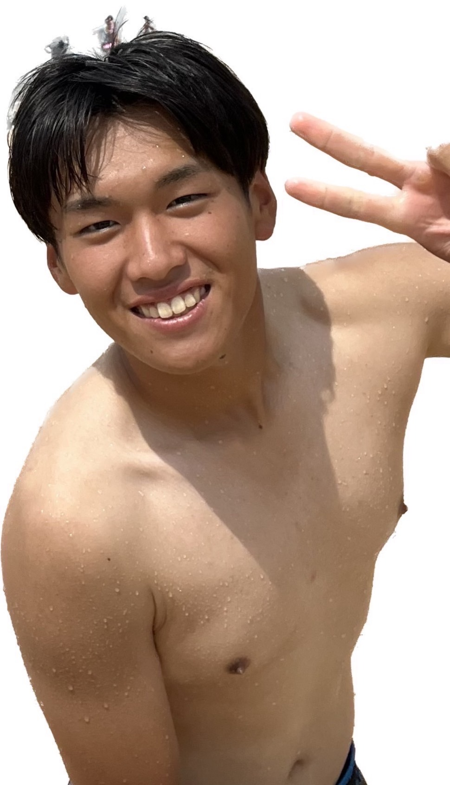
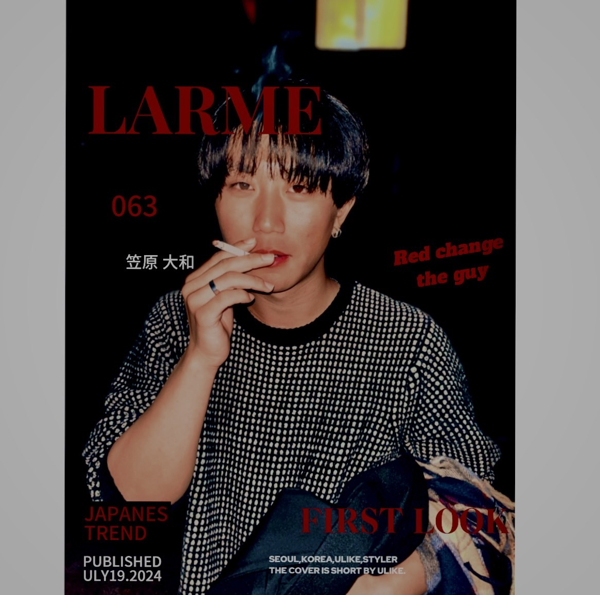
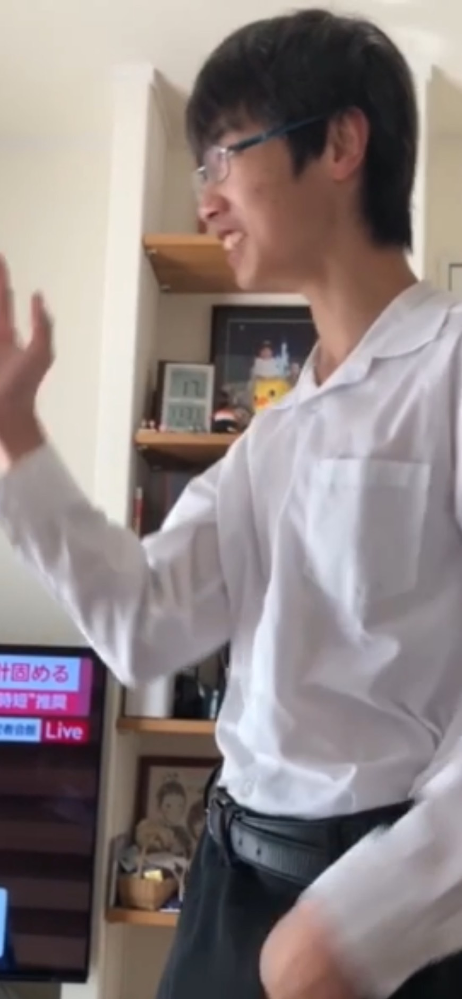

<!DOCTYPE html>
<html lang="ja">
<head>
    <meta charset="UTF-8">
    <title>New Jeans</title>
    <link rel="stylesheet" href="css/style.css"> 
    
</head>

<body>

    

        <h1>採用情報</h1>
        <ul>
            <li>PTO財閥は、低い基本給、ほぼ支給されないボーナス、極端に少ない年間休日、取得困難な有給、育児休暇取得後のキャリアに影響があるなど、過酷な労働環境と成果主義が支配する企業であり、心身ともに限界を超えて働く覚悟が必要です。</li>
            <li>PTO財閥は、新卒採用において、バリバリの学歴フィルターを強く設けており、名門大学卒やトップの学部からの応募者しかほとんど採用しない傾向があり、学歴が低いと採用のチャンスはほぼなく、厳しい選考基準を突破できるのはほんの一握りのエリートのみです。</li>
        </ul>
    

    

        <h2>清掃部門 - 清掃スタッフ</h2>
        

        <ul>
            <li>求める人物像: 体力勝負、そして精神的にもタフな人物。清掃作業を一人で黙々と続けることが求められる。</li>
            <li>仕事内容: 高層ビルやオフィスフロア、公共施設を含む広範囲な清掃業務。午前7時から深夜までシフトが組まれる。</li>
            <li>待遇: 基本給は業界平均程度だが、残業代なし。</li>
            <li>備考: 体力的にも精神的にも限界を感じることが多い業務ですが、黙々と続ければ安定して働けると考える人には向いています。</li>
        </ul>
    

    

        <h2>広告代理部門 - 広告営業・企画担当</h2>
        

        <ul>
            <li>仕事内容: 広告戦略の企画、クライアントとの商談、キャンペーンの立案・実施。業務はクライアントからの急な変更や要求に振り回され、夜遅くまで作業が続くことが常。</li>
            <li>求める人物像: 業界経験があるのはもちろん、計画的に物事を進める力よりも、即応力と忍耐力が求められる。</li>
            <li>待遇: 初任給はそこそこだが、成果を上げられない場合、営業担当としての責任を問われることが多い。</li>
            <li>備考: アドレナリンが必要な仕事で、常に「結果を出さなければ意味がない」と言わんばかりの圧力を感じます。</li>
        </ul>
    

    

        <h2>営業部門 - 営業職（新規開拓・既存顧客対応）</h2>
        

        <ul>
            <li>仕事内容: 新規顧客開拓のために無駄に多くの電話をかけ、契約を取る。数字に追われる毎日で、ノルマ未達成の場合、深夜まで働いてでも契約を取ることが求められる。</li>
            <li>求める人物像: 無理な要求にも応え、最も厳しい状況でも粘り強く契約を取れるメンタルを持っている人物。</li>
            <li>待遇: 基本給はかなり低く、インセンティブで生活することが前提。契約を取らないと昇給も昇進もないため、常に契約を取ることが最優先。</li>
            <li>備考: 目標未達成で評価が下がり、社内での立場も厳しくなるため、精神的なプレッシャーは非常に大きい。</li>
        </ul>
    

</body>
</html>
